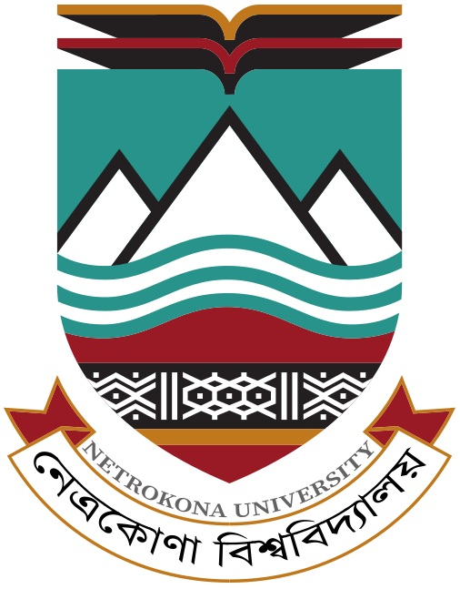

<p align="center">
	<a href="https://neu.ac.bd/">
		
	</a>
</p>

# Obsidian Study Notes

Academic lecture notes, study materials, books, slides, and lab resources for the [**Computer Science and Engineering (CSE)**](https://cse.neu.ac.bd/) program at **[Netrokona University](https://neu.ac.bd/)**.

## Program Information

- Department: [Computer Science and Engineering (CSE)](https://cse.neu.ac.bd/)
- Batch: CSE - 04
- Session: 2022-2023

## Repository Structure

The materials are organized by year, semester, and course for quick navigation.

```text
3rd year/
	1st Semester/
		_Previous Year Questions/
		Automata/
			books/
			slides/
		Computer Networking/
		Math/
		Microprocessor Lab/
		Microprocessor(Course)/
		Software Engineering/
		Software Engineering Lab/
assets/
README.md
```

## What You Will Find

- Class notes and topic-wise summaries
- Course books and slide decks
- Previous year questions
- Lab-related materials and references

## Maintainer

[**Md Saidul Islam** ](https://github.com/csesaidul) 
Registration No: 202204015  
Session: 2022-2023

- Department: [CSE](https://cse.neu.ac.bd/)
- University: [Netrokona University](https://neu.ac.bd/)
- Email: [01saidul01@gmail.com](mailto:01saidul01@gmail.com)
- GitHub: [csesaidul](https://github.com/csesaidul)

- Official CSE-04 Batch Google Drive Link: [Department of CSE-22](https://drive.google.com/drive/folders/149ufJXgSIgXnhKi7InenDsUbutBDtPc5?usp=drive_link)

## License

This repository is licensed under the MIT License. See the [LICENSE](./LICENSE) file for details.